<picture>
  <source media="(prefers-color-scheme: dark)" srcset="assets/hero-dark.svg" />
  
</picture>

<a href="https://github.com/asykixd/Evelin">
  <picture>
    <source media="(prefers-color-scheme: dark)" srcset="assets/evelin-dark.svg" />
    
  </picture>
</a>

<a href="https://github.com/asykixd/uroboros">
  <picture>
    <source media="(prefers-color-scheme: dark)" srcset="assets/uroboros-dark.svg" />
    
  </picture>
</a>

<picture>
  <source media="(prefers-color-scheme: dark)" srcset="assets/secret-vpn-dark.svg" />
  
</picture>
<picture>
  <source media="(prefers-color-scheme: dark)" srcset="assets/stats-dark.svg" />
  
</picture>

[Evelin](https://github.com/asykixd/Evelin) · [Uroboros](https://github.com/asykixd/uroboros) · [Uroboros docs](https://asykixd.github.io/uroboros/) · [uroboros-modules](https://github.com/asykixd/uroboros-modules)
