Software engineer focused on systems programming, developer tooling and desktop applications.

 

<picture>
  <source media="(prefers-color-scheme: dark)" srcset="assets/stack-dark.svg" />
  
</picture>

  

<a href="https://github.com/asykixd/Evelin">
  <picture>
    <source media="(prefers-color-scheme: dark)" srcset="assets/evelin-dark.svg" />
    
  </picture>
</a>

  

<picture>
  <source media="(prefers-color-scheme: dark)" srcset="assets/zero-tunnel-dark.svg" />
  
</picture>
<picture>
  <source media="(prefers-color-scheme: dark)" srcset="assets/userbot-dark.svg" />
  
</picture>

  

<picture>
  <source media="(prefers-color-scheme: dark)" srcset="https://github-readme-stats.vercel.app/api?username=asykixd&show_icons=true&include_all_commits=true&count_private=true&hide_border=true&hide_title=true&bg_color=0d1117&text_color=8b949e&icon_color=8b949e&title_color=e6edf3" />
  
</picture>
<picture>
  <source media="(prefers-color-scheme: dark)" srcset="https://github-readme-stats.vercel.app/api/top-langs/?username=asykixd&layout=compact&langs_count=6&hide_border=true&bg_color=0d1117&text_color=8b949e&title_color=e6edf3" />
  
</picture>
