<picture>
  <source media="(prefers-color-scheme: dark)" srcset="assets/hero-dark.svg" />
  
</picture>

  

<picture>
  <source media="(prefers-color-scheme: dark)" srcset="assets/stack-dark.svg" />
  
</picture>

  

<a href="https://github.com/asykixd/Evelin">
  <picture>
    <source media="(prefers-color-scheme: dark)" srcset="assets/evelin-dark.svg" />
    
  </picture>
</a>

  

<a href="https://github.com/asykixd/uroboros">
  <picture>
    <source media="(prefers-color-scheme: dark)" srcset="assets/uroboros-dark.svg" />
    
  </picture>
</a>

  

<picture>
  <source media="(prefers-color-scheme: dark)" srcset="assets/secret-vpn-dark.svg" />
  
</picture>
<picture>
  <source media="(prefers-color-scheme: dark)" srcset="assets/stats-dark.svg" />
  
</picture>
